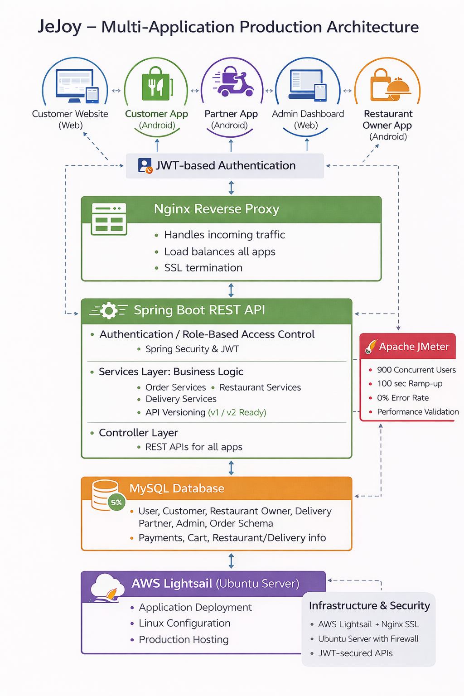
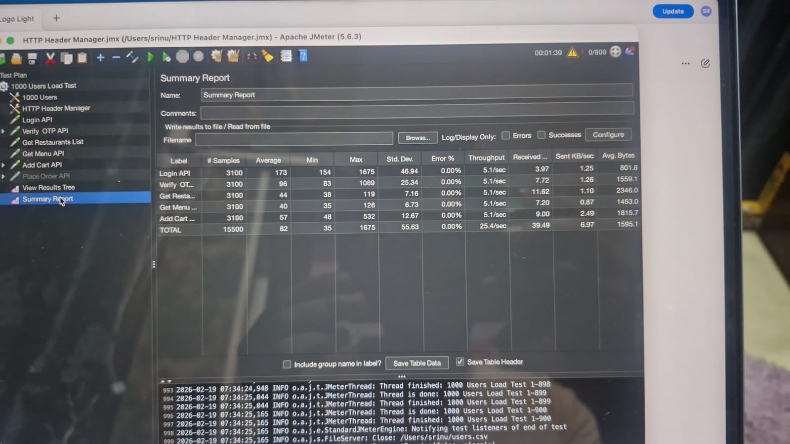

# 🚀 JeJoy – Multi-Application Production-Ready Food Delivery Ecosystem

JeJoy is a robust, full-scale food delivery platform engineered from the ground up to handle complex multi-user workflows. Built with a modular backend architecture, it seamlessly connects customers, delivery partners, and restaurant owners in real-time.

> **Note:** The source code is maintained in a private repository to protect business intellectual property. This public repository serves as a showcase of the system architecture, performance benchmarks, and engineering decisions.

---

## 🏗 System Architecture

The ecosystem relies on a highly scalable, stateless backend serving multiple client applications:
* **Customer App (Android)**
* **Delivery Partner App (Android)**
* **Restaurant Owner App (Android)**
* **Admin Dashboard (Web)**

---

## 🧠 Engineering Challenges & Solutions

As the solo architect and developer, I tackled several system-level challenges to ensure production readiness:

1.  **Secure Multi-Role Access:** * *Challenge:* Managing distinct permissions for Customers, Owners, Drivers, and Admins securely.
    * *Solution:* Implemented robust **Spring Security with JWT-based stateless authentication**, ensuring secure API access across all micro-services.
2.  **Traffic Routing & Security:**
    * *Challenge:* Handling incoming traffic efficiently while securing the application.
    * *Solution:* Configured an **Nginx Reverse Proxy** on AWS Lightsail for load balancing, traffic routing, and SSL termination, preventing direct exposure of the internal Tomcat server.
3.  **High Concurrency & Reliability:**
    * *Challenge:* Ensuring the system doesn't crash during peak food ordering hours.
    * *Solution:* Optimized database queries (MySQL) and validated system resilience using **Apache JMeter**, achieving a 0% error rate under significant concurrent load.

---

## 📊 Performance Benchmark (JMeter)

The Spring Boot backend was rigorously tested to simulate high-traffic scenarios.

* **Concurrent Users:** 900
* **Ramp-up Time:** 100 seconds
* **Error Rate:** 0.00%
* **Throughput:** Highly stable under maximum load

---

## ⚙️ Technical Stack Deep-Dive

* **Backend:** Java 17, Spring Boot, Spring Security (JWT), Hibernate/JPA, REST API Design (v1/v2 ready)
* **Frontend/Mobile:** React.js, React Native (TypeScript), Vite
* **Database:** MySQL (Relational Schema Design)
* **Infrastructure & DevOps:** AWS Lightsail (Ubuntu), Nginx (Reverse Proxy & SSL), Linux Server Administration
* **QA & Testing:** Apache JMeter, Postman

---

## 📫 Let's Connect

I am a self-taught Full-Stack Developer with a background in Mechanical Engineering. I specialize in building end-to-end products and architecting scalable backend systems.

* **Developer:** Srinu R
* **LinkedIn:** [Add Your LinkedIn URL Here]
* **Email:** [iamsrinur94@gmail.com]
